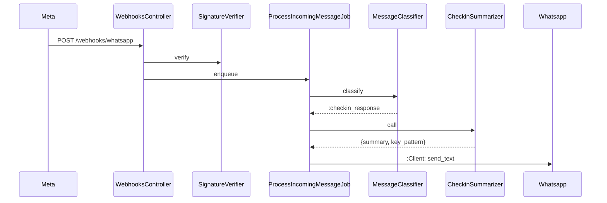

# Documentation

## Where things go

| What | Where |
|------|-------|
| Non-obvious decision + rationale | `docs/decisions.md` (append, never rewrite) |
| Architecture diagram, domain model, env vars | `AGENTS.md` |
| User-facing setup steps | `README.md` |
| Why a tricky line exists | inline comment |
| Long-form design proposal | `docs/adr/NNNN-<slug>.md` |

## docs/decisions.md

Append-only log of choices that future-you will ask "why did we do this?". Structure:

```
## <Topic>

- **<Decision>.** <Rationale in 2–4 lines.> If <reversal condition>, do <X>.
```

Trigger to write: chose option A over B; deviated from plan; picked unusual tool; rejected obvious approach. Don't document things obvious from the code.

## AGENTS.md

Source-of-truth for AI agents and new humans. Update when:
- New service → add row to service-objects table.
- New env var → add to env-vars table + `.env.example`.
- Architecture change → update ASCII diagram.
- New cron job → update cron list.
- New "known gap" → add to gaps section.

Never let it drift. A stale `AGENTS.md` is worse than none — agents act on it.

## Architecture diagrams

ASCII inside `AGENTS.md` for top-level flow (already there). For deeper diagrams use Mermaid in `docs/diagrams/<name>.md`:



Render locally with any Mermaid viewer. Don't commit PNGs — source-of-truth is the Mermaid text.

## ADRs (`docs/adr/`)

Use for decisions worth more than a `docs/decisions.md` bullet:
- New external dependency (payment, transcription, deploy platform)
- Schema redesign
- Breaking change to message flow

Template:

```
# NNNN — <title>

Status: proposed | accepted | superseded by NNNN
Date: YYYY-MM-DD

## Context
<why we need to decide>

## Decision
<what we chose>

## Consequences
<trade-offs accepted, what becomes harder, what becomes easier>

## Alternatives considered
- Option B — rejected because ...
```

## Inline comments

Default: none. Add only when:
- WHY is non-obvious (hidden constraint, subtle invariant).
- Workaround for a specific upstream bug — link to it.
- Behavior that would surprise a careful reader.

Never comment WHAT the code does. Never reference PRs/tickets — those rot.

## Functional explanations

When adding a feature visible to participants (new day-content phase, new template, new classifier branch), describe the user-facing behavior in `AGENTS.md` "Architecture" or a new `docs/features/<name>.md`. Include:
- Trigger
- Expected response
- Edge cases
- Failure mode

## Checklist before merging

- [ ] Non-obvious decision logged in `docs/decisions.md`?
- [ ] `AGENTS.md` reflects new service / env var / cron?
- [ ] New diagram or updated one if flow changed?
- [ ] Inline comment only where WHY isn't obvious?
- [ ] `.env.example` updated?
