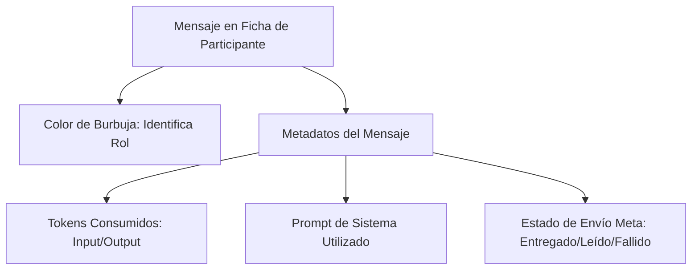

# Guía de Uso del Panel de Administración

Esta guía está diseñada para los **administradores y operadores de la plataforma**. Explica cómo navegar por las secciones del panel, realizar operaciones comunes de gestión y monitorear el comportamiento de los participantes.

Además de la operación diaria, el área **Documentación** del panel expone tanto la base técnica/pedagógica del producto como los documentos de estrategia comercial usados para el lanzamiento B2B de **Impulso by Comtraining**.

---

## 1. Introducción al Panel Nivo (`/admin`)

El panel de administración es una interfaz a medida construida de forma nativa en Rails. Su objetivo es dar visibilidad completa del estado de la plataforma a los operadores no técnicos sin sacrificar velocidad.

Para ingresar se requiere un usuario administrador (`AdminUser`) configurado mediante credenciales seguras de Devise.

---

## 2. Secciones del Sistema

El panel se organiza en una barra lateral dividida en dos grupos de navegación:

| Sección | Propósito | Operaciones Clave |
|---------|-----------|-------------------|
| **Inicio (Dashboard)** | Visión general del estado en tiempo real. | Ver métricas generales (activos, errores, mensajes de hoy). |
| **Programas** | Definición del programa de coaching. | Crear programas y activar/desactivar la secuencia. |
| **Días y Contenidos** | Consola transversal del contenido pedagógico. | Filtrar por programa, día, fase, estado o texto para auditar y editar prompts, retos y preguntas. |
| **Participantes** | El núcleo de la administración de usuarios. | Inscribir nuevos usuarios, pausar, archivar, auditar chat. |
| **Mensajes** | Historial crudo de la base de datos de mensajes. | Ver metadatos de tokens y estado de entrega de Meta. |
| **Reportes Diarios** | Resúmenes cognitivos del check-in nocturno. | Leer los patrones de comportamiento detectados por la IA. |
| **Prompts IA** | Gestión del registro y versiones de prompts de OpenAI. | Ver historial de versiones, editar comportamiento cognitivo. |
| **Pendientes** | Moderación y aprobación manual de respuestas de IA. | Revisar respuestas automáticas, editar y autorizar envíos. |
| **Configuración** | Parámetros del sistema modificables en vivo. | Cambiar la hora de despertar o el retraso del IAReto. |
| **Administradores** | Gestión del equipo de soporte. | Agregar o eliminar usuarios con acceso al panel. |
| **Auditoría** | Registro detallado de cambios sobre recursos. | Ver historial de versiones y auditoría de campos (PaperTrail). |
| **Sidekiq ↗** | Consola técnica de tareas en segundo plano. | Monitorear colas de envíos retrasados o reintentos de red. |

---

## 3. Operaciones Comunes de Gestión

### 3.1 Inscribir a un Nuevo Participante (Enrollment)
Para dar de alta a un usuario en el programa:
1. Dirígete a **Participantes** y haz clic en **Inscribir Participante**.
2. Completa los campos:
   * **Teléfono:** Debe estar en formato internacional estricto E.164 (ej: `+56912345678`). No uses espacios ni guiones.
   * **Zona Horaria:** Selecciona el huso del participante (ej: `America/Santiago`). Esto es crítico para que sus mensajes le lleguen a la hora local correspondiente.
   * **Programa:** Si se deja en blanco, se asignará el programa activo por defecto.
3. Al guardar, el participante quedará en estado `active` y se encolará automáticamente su **Mensaje de Bienvenida** por WhatsApp.

### 3.2 Pausar o Reactivar a un Participante
Si un participante se va de vacaciones o pide pausar las interacciones:
1. Entra a la ficha del participante en **Participantes**.
2. Haz clic en **Editar**.
3. Cambia el campo **Estado (Status)**:
   * `paused`: Detiene inmediatamente todo envío de mañana, tarde e IAReto. No perderá su día actual (`current_day`).
   * `active`: Reanuda el envío en el próximo ciclo programado.
4. Haz clic en **Actualizar**.

### 3.3 Archivar / Eliminar (Soft Delete)
Para no saturar las listas con participantes de prueba antiguos o que abandonaron:
1. En la lista de participantes o en su ficha detallada, haz clic en **Archivar**.
2. Esto ejecuta un borrado lógico (*soft delete*). El participante desaparecerá de las listas generales de forma segura.
3. Sus mensajes y costos asociados de IA se conservan en la base de datos para auditorías financieras.
4. Para revertirlo, los administradores pueden hacer clic en **Desarchivar** desde la ficha de auditoría si es necesario.

### 3.4 Gestionar contenidos de un programa
Para trabajar los días de un programa específico:
1. Entra a **Programas** y abre el programa correspondiente.
2. Desde la ficha del programa usa **Gestionar Contenidos** o **Ver Todos**.
3. Allí verás solo los `DayContent` de ese programa y podrás crear nuevos días manteniendo ese contexto.
4. La pantalla global **Días y Contenidos** sigue disponible para búsquedas transversales con filtros por programa, día, fase, estado y texto libre.

---

## 4. Auditoría y Diagnóstico Visual

### 4.1 La Ficha del Participante (Chat Visual)
Al ingresar al detalle de cualquier participante, verás su historial de conversación en un formato de chat similar a WhatsApp. Esta interfaz te permite:
* **Ver qué se dijo:** Diferencia visual de burbujas (Verde = Participante, Blanco = IA, Gris = Mensajes de Sistema automáticos).
* **Auditar la IA:** Cada mensaje enviado por la IA muestra en letras pequeñas los tokens de entrada/salida y el modelo usado.
* **Ver el prompt real:** Puedes hacer clic en el botón de metadatos del mensaje de la IA para revisar el prompt exacto de sistema que se le envió a OpenAI en ese instante.

### 4.2 Monitoreo de Configuración en Vivo (`Settings`)
La sección **Configuración** expone variables globales de negocio almacenadas en la base de datos:
* `wake_hour`: Por defecto `7` (envía el despertar a las 07:00 AM local del participante).
* `checkin_hour`: Por defecto `20` (envía el check-in a las 20:00 local del participante).
* `iareto_delay_minutes`: Por defecto `30` (espera 30 minutos desde el despertar para enviar el reto).

> [!TIP]
> **Cambios sin Deploy:**
> Si cambias el `wake_hour` de `7` a `8` en la interfaz, el cambio toma efecto en el siguiente ciclo de hora de Sidekiq de forma inmediata. No requiere que los programadores reinicien la aplicación ni hagan un nuevo deploy de código.

### 4.3 Historial de Mensajes (Conversations)
Esta sección muestra el registro completo e inmutable de los mensajes intercambiados con los participantes vía WhatsApp.
* **Auditoría de Costos:** Cada mensaje saliente generado por la IA muestra el desglose de tokens de entrada/salida y el modelo utilizado.
* **Trazabilidad de Entrega:** Puedes revisar el estado de entrega en tiempo real de Meta (ej: *enviado*, *entregado*, *leído*, o *fallido* con el código de error correspondiente).

### 4.4 Reportes Diarios y Patrones de IA
El sistema genera resúmenes diarios a partir de las respuestas de los participantes al check-in nocturno.
* **Resumen Cognitivo:** La IA sintetiza el estado emocional y progreso de cada participante para los tutores.
* **Detección de Patrones:** Analiza las respuestas del participante y extrae un patrón clave de comportamiento diario para personalizar las interacciones del día siguiente.

### 4.5 Prompts de IA y Plantillas
Aquí se gestiona el comportamiento cognitivo de los asistentes inteligentes.
* **Edición de Prompts de Sistema:** Permite editar los prompts de OpenAI de cada fase (`see`, `choose`, `anchor`) para modificar la personalidad y pedagogía de la IA.
* **Control de Versiones:** Cada cambio genera una nueva versión, permitiendo auditar y restaurar prompts anteriores si el comportamiento de la IA diverge del deseado.

### 4.6 Respuestas Pendientes de Moderación
Cuando el sistema opera bajo modo de moderación manual, los mensajes generados por la IA no se envían automáticamente.
* **Aprobación Obligatoria:** Los mensajes quedan encolados en estado `pending_action`.
* **Acciones de Soporte:** Un administrador puede revisar la respuesta generada por la IA, editarla para corregir detalles pedagógicos o de redacción, y aprobarla para encolar el envío definitivo.

### 4.7 Administradores y Miembros del Equipo
Administración de cuentas con acceso restringido al panel.
* **Seguridad:** Utiliza Devise para la autenticación segura.
* **Gestión del Equipo:** Permite crear nuevos operadores de soporte y dar de baja a usuarios que ya no pertenecen al equipo.

### 4.8 Auditoría y Registro de Versiones
Trazabilidad de seguridad para todas las acciones dentro del panel.
* **PaperTrail:** El sistema registra de manera automática cualquier creación, actualización o borrado en los modelos clave.
* **Transparencia:** Puedes auditar qué administrador modificó un participante, un programa, o una configuración del sistema, junto con los valores anteriores y posteriores de cada campo.

---

## 5. Catálogo de Habilidades

El catálogo contiene las competencias humanas que la IA del sistema puede identificar en las conversaciones libres o de check-in del participante.

* **Identificación Asíncrona:** La IA analiza las conversaciones y registra de 0 a 3 habilidades asociadas.
* **Coaching Personalizado:** La habilidad más dominante del participante se inyecta dinámicamente como sugerencia al generador de mensajes. Esto permite adaptar el contenido cognitivo a las necesidades conductuales del usuario.
* **Guía de Acompañamiento:** Al abrir una habilidad, se muestra su definición, por qué importa, trampas comunes y una guía metodológica completa (Señales, Prácticas, Gestos y Ejercicios) para facilitar el coaching humano.
