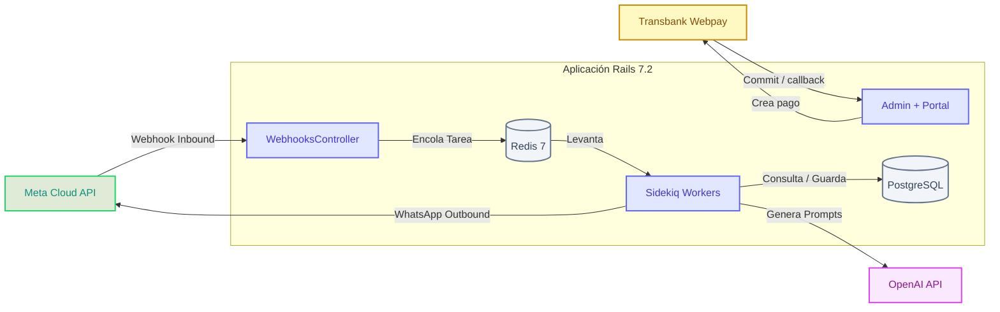
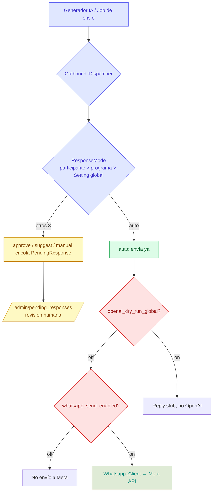
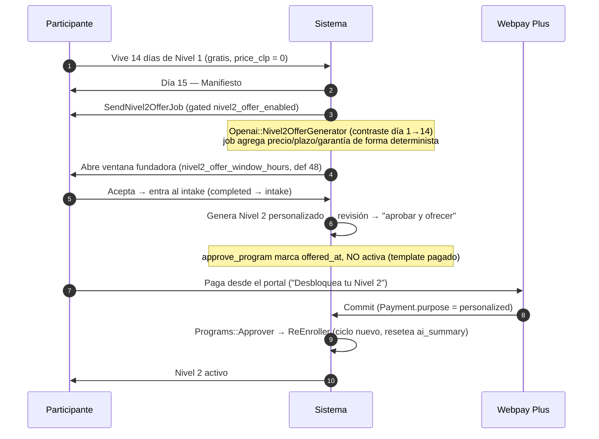
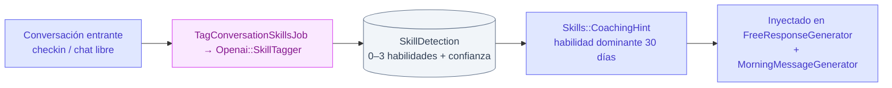

# Arquitectura Técnica y Flujos de la Plataforma

Esta guía describe la arquitectura de software, los flujos de datos asincrónicos, los sistemas de mensajería y la integración de IA.

> [!NOTE]
> La fuente canónica de *reglas de negocio* es [`docs/business-rules.md`](business-rules.md). Esta nota describe *cómo fluyen los datos*; las decisiones de *por qué* viven en [`docs/decisions.md`](decisions.md).

---

## 1. Arquitectura de Alto Nivel

La aplicación es un monolito Rails 7.2 con PostgreSQL 16, cola asincrónica en Redis 7 gestionada por Sidekiq, y dos integraciones externas: Meta WhatsApp Cloud API (mensajería) y OpenAI (generación). Los pagos se procesan vía Transbank Webpay (Plus + Oneclick).



Despliegue: Kamal sobre un único host Hetzner (roles `web` + `worker`), Postgres y Redis como accesorios. Ver [`config/deploy.yml`](../config/deploy.yml) y la sección Deployment de [`CLAUDE.md`](../CLAUDE.md).

---

## 2. Flujo de Procesamiento del Webhook de WhatsApp

Cuando un participante interactúa por WhatsApp, Meta envía un POST a nuestro endpoint. El controller debe responder en <5 s, por lo que solo verifica firma y encola; todo el trabajo real corre en `ProcessIncomingMessageJob`.

```mermaid
sequenceDiagram
    autonumber
    participant Meta as Meta API
    participant Controller as WebhooksController
    participant Verifier as SignatureVerifier
    participant Redis as Redis Queue
    participant Job as ProcessIncomingMessageJob
    participant Audio as AudioProcessor
    participant Classifier as MessageClassifier
    participant AI as Openai::*Generator
    participant Dispatcher as Outbound::Dispatcher

    Meta->>Controller: POST /webhooks/whatsapp (payload + X-Hub-Signature-256)
    Controller->>Verifier: verify(payload, signature) — secure_compare
    alt Firma inválida
        Verifier-->>Controller: false
        Controller-->>Meta: 401 Unauthorized
    else Firma válida
        Verifier-->>Controller: true
        Controller->>Redis: Encolar ProcessIncomingMessageJob(payload)
        Controller-->>Meta: 200 OK (retorno inmediato)
    end

    Note over Job: Sidekiq procesa en background
    Redis->>Job: Ejecuta Job
    Job->>Job: Reactiva si estaba paused; chequea cap de mensajes libres
    alt Mensaje de audio
        Job->>Audio: fetch + transcribe + voice_analysis
        Audio-->>Job: transcription + voice_analysis (jsonb)
    end
    Job->>Classifier: classify(participant, message)
    Note over Classifier: program_intake | initial_pattern_answer | checkin_response | free_user
    Classifier-->>Job: clasificación
    Job->>AI: Genera respuesta según clasificación
    AI-->>Job: { body, tokens, model }
    Job->>Dispatcher: dispatch(participant, body, moment)
    Note over Dispatcher: ResponseMode decide auto vs revisión humana
```

### 2.1 Audio: se procesa, no se rechaza
Los mensajes de voz **sí se procesan**. `Participants::AudioProcessor` orquesta `Whatsapp::MediaFetcher` (descarga bytes de Meta Graph) → `Openai::AudioTranscriber` (Whisper / `gpt-4o-mini-transcribe`) → `Openai::VoiceAnalyzer` (`gpt-4o-mini-audio-preview`, infiere tono/emoción/energía/pace; requiere ffmpeg, omite limpio si falta). Persiste `transcription` y `voice_analysis` (jsonb) sobre la `Conversation` entrante.

### 2.2 Clasificación de mensajes entrantes
`Participants::MessageClassifier` retorna una de cuatro etiquetas (precedencia en este orden):

| Etiqueta | Condición | Handler |
|----------|-----------|---------|
| `program_intake` | Participante en `status: :intake` | `IntakeHandler` (state machine del cuestionario) |
| `initial_pattern_answer` | Aún no se registró `initial_pattern` | Guarda patrón inicial |
| `checkin_response` | En ventana de check-in con check-in pendiente | `CheckinSummarizer` → `DailyReport` |
| `free_user` | Default | `FreeResponseGenerator` |

---

## 3. El Punto de Salida Único: `Outbound::Dispatcher` + `ResponseMode`

Esto es el corazón del control humano-en-el-loop. **Todo** envío saliente pasa por `Outbound::Dispatcher`, que consulta `ResponseMode` para decidir si entrega de inmediato o encola para revisión.



* **`ResponseMode`** resuelve `auto / approve / suggest / manual` con precedencia **participante > programa > Setting global**. `auto` entrega; los otros tres encolan un `PendingResponse` para que un humano revise/edite/envíe desde `/admin/pending_responses`.
* **Dos kill-switches independientes** debajo del Dispatcher:
  * `Setting "openai_dry_run_global"` — no llama a OpenAI, devuelve un stub.
  * `Setting "whatsapp_send_enabled"` — no envía a Meta.
* `Dispatcher` retorna un `Result` (`delivered?` / `queued?`) e idempotencia vía el concern `IdempotentOutbound`.
* **Envío manual del admin**: `Outbound::AdminMessage` envuelve al Dispatcher con `mode: "auto"` + `moment: :admin_manual`; gatea texto libre con `in_24h_window?`. Lo usan el panel (envío único) y `SendAdminMessageJob`/`BroadcastMessageJob` (broadcast).

---

## 4. Cadencia y Cron Jobs (`config/schedule.yml`)

`sidekiq-cron` programa los procesos repetitivos. Patrón de los jobs horarios: un job "fan-out" corre cada hora y reparte a un job por-participante según hora local.

| Cron (UTC) | Job | Qué hace |
|------------|-----|----------|
| `0 * * * *` (horario) | `MorningWakeJob` | Fan-out a `MorningWakeForParticipantJob` para quienes su hora local == `Setting wake_hour` |
| `0 * * * *` (horario) | `CheckinEveningJob` | Mismo patrón a las 20:00 local |
| `0 * * * *` (horario) | `CoachSessionReminderJob` | Recordatorio WhatsApp de sesiones 1-1 confirmadas dentro de `coach_session_reminder_lead_hours` |
| `0 6 * * *` | `AdvanceDayJob` | `Participants::DayAdvancer`: avanza `current_day` de quienes hicieron check-in ayer |
| `0 3 * * *` | `DailyBackupJob` | `pg_dump` → Google Drive (service account), poda backups >7 días |
| `30 3 * * *` | `RefreshMethodologyInsightsJob` | Materializa `MethodologyInsight` para las pestañas Metodología |
| `15 4 * * *` | `RevalidateResourcesJob` | Re-chequea recursos aprobados obsoletos, marca enlaces muertos |
| `0 4 * * 1` (lunes) | `AutoPromptTuningJob` | Puntúa calidad del chat libre y propone/aplica mejoras de guardrails |
| `0 5 * * *` | `PauseInactiveParticipantsJob` | Pausa `active` sin inbound en `inactivity_pause_days` (un inbound reactiva) |
| `30 5 * * *` | `ExpireAbandonedIntakesJob` | Saca de `:intake` a los estancados (`intake_abandonment_days`) |

> [!NOTE]
> `SubscriptionBillingJob` y `CapacityAlertJob` existen en `app/jobs/` pero **no están en `config/schedule.yml`** actualmente (suscripciones recurrentes Oneclick siguen tras el kill-switch `webpay_oneclick_enabled`, OFF). Si se reactivan, hay que reañadir sus entradas de cron.

### 4.1 Avance de Día (`AdvanceDayJob` → `Participants::DayAdvancer`)
Corre a las **06:00 UTC**. Para cada participante activo:
1. **Verifica check-in:** ¿existe `Conversation moment: :checkin_response, day_number: current_day` creado hoy en su zona horaria?
2. **Avanza:** si respondió, `current_day += 1`.
3. **Cierre:** si completó el día 14 con check-in, `status: :completed`, estampa `completed_at`, encola `GenerateAndSendManifestoJob` (día 15) y, si `nivel2_offer_enabled`, `SendNivel2OfferJob`.
4. **Sin re-engagement:** si no respondió, queda congelado en su día actual (no se reenvía nada, no avanza).

---

## 5. Flujo de Programa Personalizado (Intake → Generación → Revisión → Activación)

El embudo principal de producto. Un participante responde un cuestionario por WhatsApp y la IA genera un programa a medida que un humano revisa antes de activar.

```mermaid
flowchart LR
    Start[IntakeStarter<br/>status: intake]:::app
    Q[IntakeHandler<br/>state machine WhatsApp]:::app
    Gen[Openai::ProgramGenerator<br/>spec JSON validado]:::ai
    Build[Programs::Builder<br/>template inactivo]:::app
    Review[/admin/program_reviews<br/>revisión humana/]:::warn
    Approve[Programs::Approver<br/>Cloner + Activator]:::ok
    Live[Programa vivo + activo]:::ok

    Start --> Q -->|completa| Gen --> Build --> Review -->|aprueba| Approve --> Live

    classDef app fill:#e0e7ff,stroke:#6366f1,color:#4338ca;
    classDef ai fill:#fae8ff,stroke:#d946ef,color:#86198f;
    classDef warn fill:#fef9c3,stroke:#ca8a04,color:#854d0e;
    classDef ok fill:#dcfce7,stroke:#16a34a,color:#166534;
```



* `Participants::IntakeStarter` flipea a `status: :intake`, resetea `intake_state`, envía el opener (`SendIntakeOpenerJob` — contacto frío no recibe texto libre).
* `IntakeHandler` + `IntakeQuestions` graban una respuesta por paso en `Participant#intake_state` (jsonb); al completar dispara `ProgramGenerationJob`.
* `Openai::ProgramGenerator` produce un **spec** (JSON mode + validación estructural + prefijo de prompt-caching). `Programs::Builder` lo persiste como `Program` **template** (`template: true, active: false`) + `DayContent`s.
* Revisión humana obligatoria (`program_intake_review_required` ON). Cola en `/admin/program_reviews`.
* `Programs::Approver`: clona el template (`Programs::Cloner` → copia viva por participante), asigna, siembra `initial_pattern`, llama a `Participants::Activator`.
* Gated por `program_intake_enabled`. Abandono manejado por `ExpireAbandonedIntakesJob`. Ver `business-rules.md` §29.

---

## 6. Flujo del Modelo de Negocio: Prueba Gratis 14 días → Nivel 2 Pagado

Embudo invertido: el pago se mueve de la puerta al **final** del programa gratis (ver `business-rules.md` §32).



* **Precio por programa**: `Program#price_clp` (0 = gratis) y `Program#founder_price_clp` (solo dentro de la ventana). `Programs::Cloner` copia ambos al clon.
* **Pago único Webpay Plus** (no suscripción). `PaymentsController` (`/pagos`, `#reenroll_personalized`). `Webpay::Client` honra `webpay_enabled` + `webpay_environment`.
* **Garantía condicional**: quien paga puede reclamar un ciclo extra gratis dentro de `guarantee_claim_window_days` (v1 honrado por admin: `#grant_guarantee` → `ReEnroller`).
* **Pago en la puerta (§21)** sigue existiendo para individuos que `payment_required?` (enrolan como `awaiting_payment`; el commit los activa). Empresas que cubren membresía activan de inmediato.
* Embudo de conversión en `/admin/funnel`.

---

## 7. Detección de Habilidades + Coaching Personalizado



Catálogo de 82 habilidades humanas (`Skill`, importadas de `db/seeds/skills_source/`). `Openai::SkillTagger` clasifica cada mensaje contra el catálogo (JSON mode, catálogo como prefijo estable para prompt-caching) y persiste `SkillDetection`. `Skills::CoachingHint` inyecta coaching sobre la habilidad dominante en los mensajes generativos. Kill-switches: `skill_tagging_enabled` / `skill_coaching_injection_enabled`. Ver `business-rules.md` §24.

---

## 8. Salvaguardas y Reglas Críticas

### 8.1 Ventana de 24 horas de Meta (Free-form vs Templates)
WhatsApp solo permite texto libre si el participante envió un mensaje en las últimas 24 h (`in_24h_window?`).
* **Dentro de la ventana:** texto libre generado por IA.
* **Fuera de la ventana:** plantilla pre-aprobada (`Whatsapp::TemplateSender`). Enviar texto libre fuera de ventana → Meta lo rechaza y arriesga suspensión.
* Los jobs de envío (`SendIaretoJob`, `CheckinForParticipantJob`, etc.) evalúan `in_24h_window?` y caen a template si es falso.

### 8.2 Idempotencia
Para evitar reenvíos en reintentos de Sidekiq, cada job de envío chequea la existencia de un `Conversation` para ese `moment` + `day_number` antes de proceder:

```ruby
return if participant.conversations.where(
  moment: :morning_wake,
  day_number: current_day,
  created_at: Time.current.all_day
).exists?
```

El Dispatcher también ofrece idempotencia vía el concern `IdempotentOutbound`.

### 8.3 Soft deletes
`Participant` y `Conversation` usan el gem `discard`. Siempre scopear con `.kept`.

---

## 9. Diseño y Costos de IA (Prompt Caching)

El costo de OpenAI está dominado por los tokens del prompt del sistema. Para mitigarlo, prompt caching es obligatorio:

> [!IMPORTANT]
> **Prompt Caching en OpenAI:**
> OpenAI da descuento (~50%) en tokens de entrada cacheados y reduce latencia cuando el prompt del sistema reutiliza los mismos bloques iniciales. Todo generador (`MorningMessageGenerator`, `FreeResponseGenerator`, `CheckinSummarizer`) concatena `Openai::ProgramManifesto::TEXT` al inicio del system prompt (~1.200 tokens, sobre el umbral de 1.024 tokens que exige el caché automático). Los servicios que clasifican contra un catálogo (`SkillTagger`, `ProgramGenerator`) usan el catálogo como prefijo estable con el mismo fin.

Cada llamada a OpenAI se registra vía `Openai::PromptLogger` (`PromptExecution` con tokens/latencia), base del Sistema de Aprendizaje Continuo — ver [`docs/learning-system.md`](learning-system.md).
