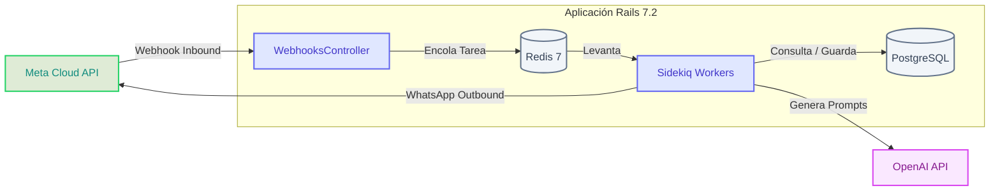
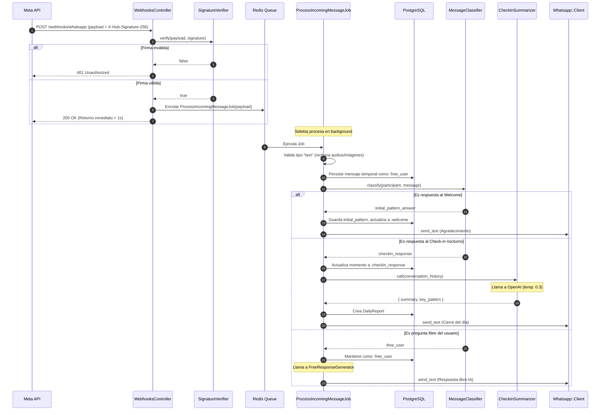
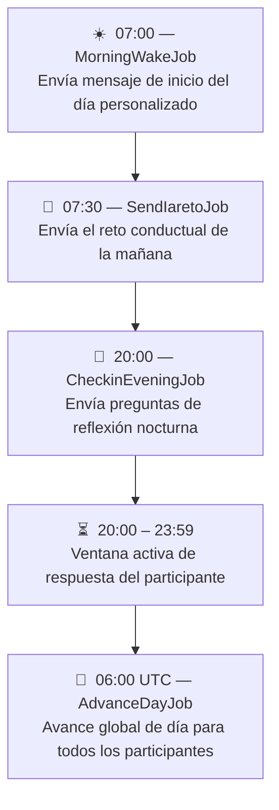

# Arquitectura Técnica y Flujos de la Plataforma

Esta guía describe la arquitectura de software, los flujos de datos asincrónicos, los sistemas de mensajería y la integración de IA.

---

## 1. Arquitectura de Alto Nivel

La aplicación está construida como una aplicación monolítica Rails 7.2 con una base de datos PostgreSQL 16 y una cola de tareas asincrónicas en Redis 7 gestionada por Sidekiq.



---

## 2. Flujo de Procesamiento del Webhook de WhatsApp

Cuando un participante interactúa por WhatsApp, Meta envía una solicitud POST HTTP a nuestro endpoint. Este flujo debe ser ultra-rápido y asincrónico para cumplir con el timeout de 5 segundos de Meta.



---

## 3. Cadencia y Cron Jobs Diarios

Los procesos repetitivos están programados mediante `sidekiq-cron` en el archivo `config/schedule.yml`.



### 3.1 Avance de Día (`AdvanceDayJob`)
Este job corre globalmente a las **06:00 UTC** diariamente. Llama a `Participants::DayAdvancer`, el cual realiza las siguientes validaciones para cada participante activo:

1. **Verificación de Check-in:** Busca si el participante tiene un mensaje con `moment: :checkin_response` y `day_number: current_day` creado en el día de hoy en su zona horaria.
2. **Avance:** Si respondió, incrementa `current_day` en 1.
3. **Cierre:** Si ya completó el día 14 e hizo check-in, cambia el estado a `:completed`, estampa `completed_at` y encola el `GenerateAndSendManifestoJob` para el día 15.
4. **Sin re-engagement:** Si no respondió el check-in, el participante se queda congelado en su día actual. Ningún mensaje del día actual se reenvía para evitar spam, pero tampoco avanza de día hasta que complete el reto pendiente.

---

## 4. Salvaguardas y Reglas Críticas del Negocio

### 4.1 La Ventana de 24 Horas de Meta (Free-form vs Templates)
Por políticas comerciales de WhatsApp, solo se pueden enviar mensajes de texto libre (free-form) si el participante ha enviado un mensaje en las últimas 24 horas (`in_24h_window?`). 

* **Si está dentro de la ventana:** Podemos enviar texto libre generado dinámicamente por la IA.
* **Si está fuera de la ventana:** Estamos obligados a usar una plantilla (Template) pre-aprobada por Meta. Si intentamos enviar un texto libre, Meta rechazará el mensaje, lo que puede resultar en suspensiones de cuenta.
* **En el código:** `SendIaretoJob` y `CheckinForParticipantJob` evalúan `participant.in_24h_window?`. Si es falso, llaman a `Whatsapp::TemplateSender` en lugar de enviar el texto de la IA directamente.

### 4.2 Idempotencia de Tareas
Para evitar el reenvío de mensajes duplicados en caso de reintentos automáticos de Sidekiq por fallas de conexión:

```ruby
# Verificación de idempotencia en MorningWakeForParticipantJob
return if Participant.conversations.where(
  moment: :morning_wake, 
  day_number: current_day, 
  created_at: Time.current.all_day
).exists?
```
Cada job de envío verifica la existencia de un registro de `Conversation` en la base de datos para ese `moment` y `day_number` antes de proceder.

---

## 5. Diseño y Costos de IA (Prompt Caching)

El costo de la API de OpenAI está dominado principalmente por la cantidad de tokens enviados en el prompt del sistema (contexto). Para mitigar esto, implementamos **Prompt Caching** obligatorio:

> [!IMPORTANT]
> **Prompt Caching en OpenAI:**
> OpenAI proporciona un descuento de hasta el 50% de descuento en tokens de entrada y reduce la latencia cuando el prompt del sistema reutiliza los mismos bloques iniciales de texto. 
> Para aprovechar esto, todo generador de IA (`MorningMessageGenerator`, `FreeResponseGenerator`, `CheckinSummarizer`) debe concatenar `Openai::ProgramManifesto::TEXT` al inicio de su prompt del sistema. Este manifiesto común pesa ~1,200 tokens, lo que garantiza que califique para el caché automático de OpenAI (requiere >1,024 tokens compartidos).
