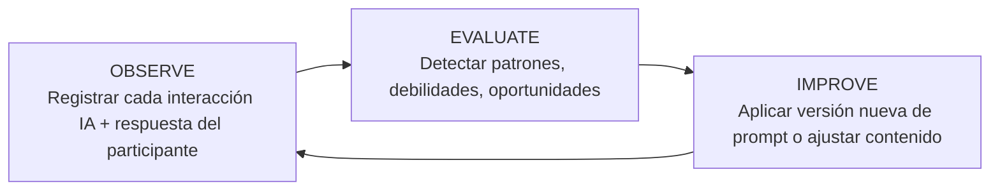

# Sistema de Aprendizaje Continuo (Prompt Learning Loop)

Impulso no es solo una app que entrega un programa de coaching de 14 días. Es **un sistema que aprende de cada cohorte para entregar un mejor programa a la siguiente**. Esta nota documenta cómo está construido ese loop y cómo se opera desde el panel de administración.

> [!NOTE]
> **Visualización en vivo:** todo lo aquí descrito se observa en [`/admin/metodologia`](/admin/metodologia). Esta nota explica el *por qué* y el *cómo* arquitectónico; el panel muestra el *qué pasó*.

---

## 1. El loop: Observe → Evaluate → Improve

Adaptación al contexto de coaching del **Prompt Learning Loop** (Arize, 2025):



* **Observe** captura señal cruda y la persiste con esquema estable.
* **Evaluate** procesa esa señal (parte vía SQL, parte vía LLM) y produce hallazgos accionables.
* **Improve** convierte hallazgos en cambios versionados que entran al sistema en producción.

El loop nunca termina. Cada ciclo deja trazabilidad para auditoría y rollback.

---

## 2. OBSERVE — Instrumentación

### 2.1 `Openai::PromptLogger`

Cada llamada a OpenAI (en `MorningMessageGenerator`, `FreeResponseGenerator`, `CheckinSummarizer`, `ManifestoGenerator`, `VoiceAnalyzer`, `PatternClusterer`) se registra automáticamente. Captura:

* `rendered_messages` (jsonb): los messages exactos enviados al modelo.
* `output_body`: respuesta del modelo.
* `tokens_input`, `tokens_output`, `latency_ms`, `model_used`.
* Contexto: `participant`, `conversation`, `day_number`, `moment`.

Se persiste en `PromptExecution`, ligado a `PromptTemplate` (la "ranura" del prompt) y `PromptVersion` (la versión específica vigente en el momento de la llamada).

### 2.2 Señal de participante

* `DailyReport.ai_summary` + `ai_key_pattern` — síntesis de la respuesta de check-in.
* `Conversation.voice_analysis` (jsonb) — tono, emoción, energía, pace cuando hay audio.
* `Conversation.transcription` — texto del audio.
* `Participant.energy_map` (jsonb) — mapa de energía longitudinal.
* `SkillDetection` — habilidades humanas detectadas por `Openai::SkillTagger` en cada check-in/chat libre (0–3 por conversación + confianza). Señal de qué competencias afloran en la población.

### 2.3 Garantías

* Idempotencia: ninguna ejecución se persiste dos veces.
* Versionado automático: si el `system_body` cambia, `PromptLogger` crea una nueva `PromptVersion`.
* Failsafe: si el logger falla, la conversación sigue (warn en log).

---

## 3. EVALUATE — Procesamiento

Dos motores de evaluación, complementarios:

### 3.1 `Openai::PromptCritic` (existente)

Toma los últimos N `PromptExecution` de un `PromptTemplate`, los envía a un modelo experto en ingeniería de prompts y recibe:

```json
{
  "findings": {
    "strengths": [...],
    "weaknesses": [...],
    "risks": [...]
  },
  "suggested_body": "nuevo system prompt completo",
  "rationale": "por qué mejora"
}
```

Persistido en `PromptAnalysis`. Disparable manualmente desde `/admin/prompt_templates/:id` (botón "Analizar").

### 3.2 `Methodology::InsightBuilder` (nuevo)

Materializa **6 vistas agregadas** en la tabla `methodology_insights` (jsonb payload). Corre nocturnamente vía `RefreshMethodologyInsightsJob` (cron 03:30 UTC).

| Scope | Cómo se construye | Para qué sirve |
|-------|-------------------|----------------|
| `key_pattern_cluster` | LLM (`Openai::PatternClusterer`) agrupa los últimos N `ai_key_pattern` en temas con frecuencia + distribución por fase + IDs origen | Lecciones aprendidas — qué patrones recurren en la población |
| `voice_trend_by_phase` | SQL sobre `conversations.voice_analysis` agrupado por fase del participante | Tono dominante por fase — ¿la fase Choose suena más ansiosa que See? |
| `prompt_finding_digest` | SQL sobre `prompt_analyses` recientes — clusters de `findings.weaknesses` | Debilidades recurrentes en prompts — backlog de mejora |
| `phase_kpi` | SQL: response_rate, avg chars, audio share, completion_rate por fase | Engagement por fase del programa |
| `stuck_pattern` | SQL: participantes cuyo `ai_key_pattern` se repite 3+ días seguidos | Casos para intervención humana |
| `prompt_evolution` | SQL: por `PromptTemplate`, lista de versiones con delta tokens/latencia antes vs después de cada cambio | Validar que las mejoras *de hecho* mejoraron |

Cada payload es self-contained — la UI lee una fila y renderiza.

### 3.3 `AutoPromptTuningJob` (loop semi-automático)

Corre semanalmente (cron `0 4 * * 1`, lunes). Puntúa la calidad del chat libre reciente y, según el resultado, **propone o aplica** mejoras a los guardrails del prompt. Es el primer eslabón donde IMPROVE puede cerrarse sin intervención manual (dentro de límites): convierte el patrón "Observe → Evaluate → propuesta de PromptVersion" en una rutina programada en vez de un click del admin. Sigue sujeto al mismo versionado (`PromptVersion`) y trazabilidad que la vía manual, por lo que un cambio malo es auditable y reversible.

---

## 4. IMPROVE — Aplicación

### 4.1 Vía manual (curada)

El admin entra a `/admin/prompt_templates/:id`, lee el análisis, hace click en **"Aplicar sugerencia"**. Esto crea una nueva `PromptVersion` con `origin: "analysis"`, vinculada al `PromptAnalysis` que la originó. La próxima llamada del servicio usa esa versión automáticamente.

### 4.2 Vía contenido (DayContent)

Editar `ai_system_prompt` en un `DayContent` desde `/admin/day_contents/:id` también dispara `record_version!` en el `PromptTemplate` asociado (key `day_system_prompt`). Mismo loop, distinta superficie.

### 4.3 Validación posterior

En `/admin/metodologia?tab=prompts` el timeline muestra, para cada `PromptTemplate`:

* Versiones publicadas con timestamp.
* **Delta tokens promedio antes/después** de cada versión.
* **Delta latencia promedio antes/después**.
* Link al `PromptAnalysis` que disparó el cambio (si aplica).

Si el delta es negativo (peor), se rollback editando manualmente o aplicando otra sugerencia.

---

## 5. Por qué este diseño

* **Reusa lo existente:** `PromptLogger`, `PromptCritic`, Kramdown, Sidekiq cron — sin infraestructura nueva.
* **Capa agregadora delgada:** una sola tabla nueva (`methodology_insights`) y un job nocturno. UI lee filas pre-materializadas.
* **Trazabilidad:** cada cluster guarda IDs de `DailyReport` y `Conversation` origen. Cada cambio de prompt apunta al análisis que lo justifica.
* **Recursivo:** el clusterer mismo es un `PromptTemplate`, por lo que `PromptCritic` puede mejorar el clusterer. Meta-aprendizaje gratis.
* **Idempotente:** correr el job dos veces produce el mismo estado. Seguro para reintentos.

---

## 6. Operación

### 6.1 Cadencia normal

* `RefreshMethodologyInsightsJob` corre nocturnamente (cron 03:30 UTC, después de `daily_backup`).
* Admin revisa `/admin/metodologia` semanalmente para identificar mejoras candidatas.
* Cuando `PromptAnalysis` muestra una debilidad clara, se aplica.

### 6.2 Refresh manual

Botón **"Recalcular insights"** en el header de `/admin/metodologia` encola el job inmediatamente. Útil tras subir nuevo contenido o tras una cohorte grande.

### 6.3 Drill-down

Cada cluster en pestaña *Lecciones* es clicable → lleva al `DailyReport` origen → del reporte se puede navegar al participante y la conversación. La señal nunca queda huérfana.

---

## 7. Referencias

* **BCT Taxonomy v1** — Michie et al. (2013). 93 técnicas de cambio de comportamiento. [bct-taxonomy.com](https://www.bct-taxonomy.com/about).
* **Fogg Behavior Model** — BJ Fogg. *Tiny Habits: The Small Changes That Change Everything* (2020).
* **Self-Determination Theory** — Deci & Ryan.
* **Motivational Interviewing** — Miller & Rollnick.
* **Transtheoretical Model** — Prochaska & DiClemente.
* **Prompt Learning Loop** — Arize AI (2025). Observe-Evaluate-Improve para sistemas LLM en producción.
* **Coaching Effectiveness (2026)** — Boyatzis et al. *Competencies of Coaches That Predict Client Behavior Change*.
