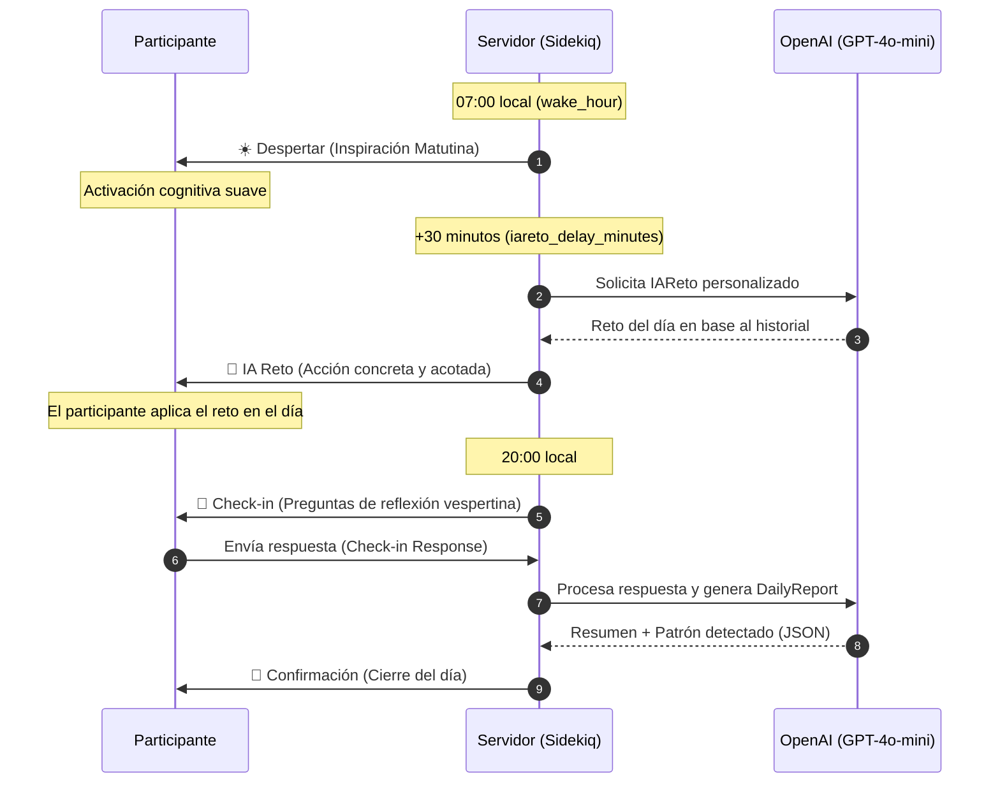

# Metodología de Micro-Coaching y Pedagogía

Impulso by Comtraining (codename interno: Piloto Automático) no es una app de productividad genérica ni un bot de autoayuda. Está diseñado en torno a principios científicos de **cambio de comportamiento**, **psicología cognitiva** y **micro-coaching de alta frecuencia**.

Esta guía detalla el marco teórico, el diseño de la experiencia del participante y los fundamentos pedagógicos del programa de 14 días.

> [!NOTE]
> **Rol dentro de la oferta comercial:**
> La metodología se empaqueta comercialmente como un programa de transferencia conductual post-capacitación para liderazgo y gestión del cambio. La pedagogía sigue siendo la misma; cambia el caso de uso prioritario con que se presenta al mercado.

---

## 1. ¿Por qué Micro-Coaching vía WhatsApp?

El coaching tradicional suele sufrir de fricción y falta de adherencia: sesiones semanales largas donde el cliente olvida lo conversado al día siguiente. 

Piloto Automático aborda esto mediante **micro-coaching**:
* **Cero fricción de canal:** El programa ocurre en WhatsApp, el entorno natural del participante. No requiere descargar apps, recordar contraseñas ni aprender nuevas interfaces.
* **Micro-ciclos de reflexión (Micro-Reflection Loops):** Interacciones diarias ultra-cortas que toman menos de 3 minutos, pero mantienen el foco y la autoconciencia activos constantemente.
* **Priming y Cierre Diario:** La separación temporal de los estímulos matutinos y vespertinos respeta los ritmos circadianos del aprendizaje y la toma de decisiones.

---

## 2. El Marco de Cambio: Ver → Elegir → Anclar (See-Choose-Anchor)

El programa de 14 días está estructurado en tres fases secuenciales basadas en la terapia cognitivo-conductual (CBT) y el modelo de diseño de hábitos de Fogg:

```mermaid
graph TD
    classDef see fill:#e0e7ff,stroke:#6366f1,stroke-width:2px,color:#4338ca;
    classDef choose fill:#fffbeb,stroke:#f59e0b,stroke-width:2px,color:#b45309;
    classDef anchor fill:#ecfdf5,stroke:#10b981,stroke-width:2px,color:#047857;

    subgraph Fase_Ver ["1. FASE VER (Ver / See) - Días 1 a 5"]
        A[Día 1-5: Autoconciencia] :::see --> B[Identificar disparadores] :::see
        B --> C[Reconocer patrones automáticos] :::see
    end

    subgraph Fase_Elegir ["2. FASE ELEGIR (Elegir / Choose) - Días 6 a 10"]
        D[Día 6-10: Experimentación] :::choose --> E[Definir alternativas de respuesta] :::choose
        E --> F[Pausar antes de actuar] :::choose
    end

    subgraph Fase_Anclar ["3. FASE ANCLAR (Anclar / Anchor) - Días 11 a 14"]
        G[Día 11-14: Consolidación] :::anchor --> H[Vincular a hábitos existentes] :::anchor
        H --> I[Celebración de micro-victorias] :::anchor
    end

    Fase_Ver --> Fase_Elegir
    Fase_Elegir --> Fase_Anclar
    Fase_Anclar --> J[Día 15: Manifiesto Final] :::anchor
```

### Fase 1: VER (Días 1 a 5)
* **Objetivo:** Traer al plano consciente los comportamientos automáticos y reactivos.
* **Justificación:** No podemos cambiar lo que no vemos. El participante se enfoca en observar *cuándo, dónde y por qué* se gatilla el comportamiento actual, sin juzgarse.
* **Lógica de la IA:** El prompt de la IA se enfoca en preguntas abiertas que promueven la auto-observación y la recolección de datos sobre uno mismo.

### Fase 2: ELEGIR (Días 6 a 10)
* **Objetivo:** Interrumpir el piloto automático cognitivo e introducir alternativas intencionales.
* **Justificación:** Una vez identificados los disparadores, creamos un "espacio entre el estímulo y la respuesta". El participante experimenta con nuevas formas de reaccionar.
* **Lógica de la IA:** La IA actúa como un facilitador de opciones, desafiando al participante a probar micro-experimentos conductuales seguros.

### Fase 3: ANCLAR (Días 11 a 14)
* **Objetivo:** Consolidar el nuevo comportamiento vinculándolo a rutinas existentes.
* **Justificación:** Los hábitos no se crean de la nada; se construyen sobre "anclas" preexistentes (por ejemplo: *"después de abrir mi laptop en la mañana, haré una respiración de 10 segundos"*).
* **Lógica de la IA:** La IA guía al participante a estructurar fórmulas claras de implementación y a celebrar la repetición.

---

## 3. La Cadencia Diaria de Interacción

La arquitectura temporal del bot está diseñada para no abrumar al participante, distribuyendo el esfuerzo a lo largo del día:



> [!NOTE]
> **La regla de los 30 minutos (iareto_delay_minutes):**
> No enviamos el reto inmediatamente con el despertar. Dejar una ventana de 30 minutos permite al participante despertar físicamente, leer el mensaje de encuadre inspiracional y prepararse mentalmente para recibir el reto del día sin sentirlo como una tarea intrusiva apenas abre los ojos.

---

## 4. El Rol de la Inteligencia Artificial: Espejo, no Gurú

El rol de la IA en Piloto Automático no es dar consejos moralistas ni resolver la vida del participante. Su rol está estrictamente delimitado a:

1. **Espejo Reflexivo:** En el check-in diario, la IA procesa la respuesta del participante y devuelve una síntesis libre de juicio. Ayuda a que el participante se lea a sí mismo desde otra perspectiva.
2. **Generador de Retos Contextuales:** La IA utiliza la respuesta inicial del participante (su `initial_pattern`) y sus reflexiones pasadas para generar un reto diario que calce con su nivel de energía y sus metas reales.
3. **Analista de Patrones:** A través del `CheckinSummarizer`, la IA extrae variables estructuradas cada noche. Esto alimenta el `DailyReport` y permite al panel de administración detectar si un participante está estancado o progresando.

---

## 5. El Cierre Pedagógico: El Manifiesto del Día 15

El día después de terminar el programa (Día 15), el participante recibe un **Manifiesto Personalizado** generado por la IA. 

> [!TIP]
> **Consolidación de Identidad:**
> En psicología del comportamiento, el cambio a largo plazo ocurre cuando el comportamiento deseado se integra a la identidad propia (*"no estoy tratando de no reaccionar con rabia, soy una persona que valora la paz"*). El Manifiesto lee las 14 respuestas y check-ins, sintetiza el viaje del participante y le devuelve un recordatorio escrito de quién es hoy y cómo sortear sus obstáculos futuros. Esto asegura un cierre con impacto emocional y práctico.
