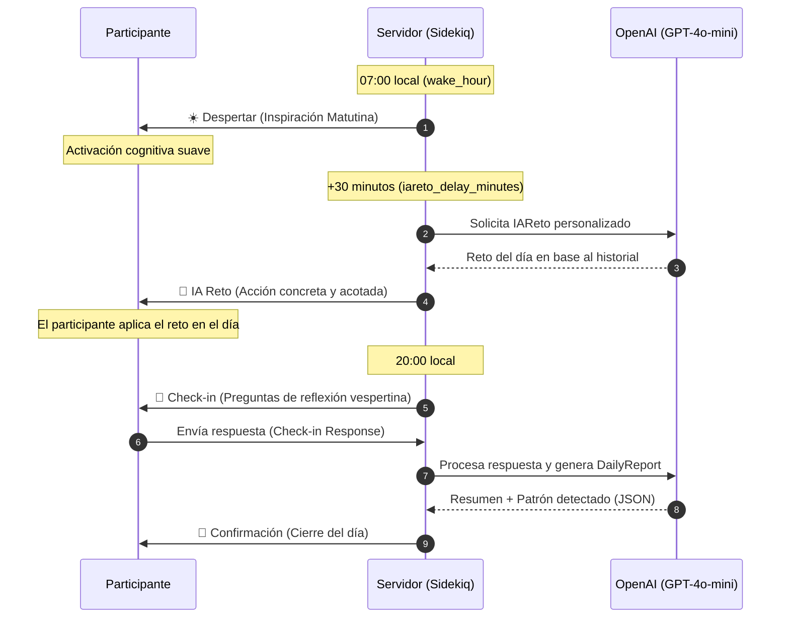

# Metodología de Micro-Coaching y Pedagogía

Impulso by Comtraining no es una app de productividad genérica ni un bot de autoayuda. Está diseñado en torno a principios científicos de **cambio de comportamiento**, **psicología cognitiva** y **micro-coaching de alta frecuencia**.

Esta guía detalla el marco teórico, el diseño de la experiencia del participante y los fundamentos pedagógicos del programa de 14 días.

> [!NOTE]
> **Rol dentro de la oferta comercial:**
> La metodología se empaqueta comercialmente como un programa de transferencia conductual post-capacitación para liderazgo y gestión del cambio. La pedagogía sigue siendo la misma; cambia el caso de uso prioritario con que se presenta al mercado.

---

## 1. ¿Por qué Micro-Coaching vía WhatsApp?

El coaching tradicional suele sufrir de fricción y falta de adherencia: sesiones semanales largas donde el cliente olvida lo conversado al día siguiente. 

El programa aborda esto mediante **micro-coaching**:
* **Cero fricción de canal:** El programa ocurre en WhatsApp, el entorno natural del participante. No requiere descargar apps, recordar contraseñas ni aprender nuevas interfaces.
* **Micro-ciclos de reflexión (Micro-Reflection Loops):** Interacciones diarias ultra-cortas que toman menos de 3 minutos, pero mantienen el foco y la autoconciencia activos constantemente.
* **Priming y Cierre Diario:** La separación temporal de los estímulos matutinos y vespertinos respeta los ritmos circadianos del aprendizaje y la toma de decisiones.

---

## 2. El Marco de Cambio: Ver → Elegir → Anclar (See-Choose-Anchor)

El programa de 14 días está estructurado en tres fases secuenciales basadas en la terapia cognitivo-conductual (CBT) y el modelo de diseño de hábitos de Fogg:

```mermaid
graph TD
    classDef see fill:#e0e7ff,stroke:#6366f1,stroke-width:2px,color:#4338ca;
    classDef choose fill:#fffbeb,stroke:#f59e0b,stroke-width:2px,color:#b45309;
    classDef anchor fill:#ecfdf5,stroke:#10b981,stroke-width:2px,color:#047857;

    subgraph Fase_Ver ["1. FASE VER (Ver / See) - Días 1 a 5"]
        A[Día 1-5: Autoconciencia] :::see --> B[Identificar disparadores] :::see
        B --> C[Reconocer patrones automáticos] :::see
    end

    subgraph Fase_Elegir ["2. FASE ELEGIR (Elegir / Choose) - Días 6 a 10"]
        D[Día 6-10: Experimentación] :::choose --> E[Definir alternativas de respuesta] :::choose
        E --> F[Pausar antes de actuar] :::choose
    end

    subgraph Fase_Anclar ["3. FASE ANCLAR (Anclar / Anchor) - Días 11 a 14"]
        G[Día 11-14: Consolidación] :::anchor --> H[Vincular a hábitos existentes] :::anchor
        H --> I[Celebración de micro-victorias] :::anchor
    end

    Fase_Ver --> Fase_Elegir
    Fase_Elegir --> Fase_Anclar
    Fase_Anclar --> J[Día 15: Manifiesto Final] :::anchor
```

### Fase 1: VER (Días 1 a 5)
* **Objetivo:** Traer al plano consciente los comportamientos automáticos y reactivos.
* **Justificación:** No podemos cambiar lo que no vemos. El participante se enfoca en observar *cuándo, dónde y por qué* se gatilla el comportamiento actual, sin juzgarse.
* **Lógica de la IA:** El prompt de la IA se enfoca en preguntas abiertas que promueven la auto-observación y la recolección de datos sobre uno mismo.

### Fase 2: ELEGIR (Días 6 a 10)
* **Objetivo:** Interrumpir el piloto automático cognitivo e introducir alternativas intencionales.
* **Justificación:** Una vez identificados los disparadores, creamos un "espacio entre el estímulo y la respuesta". El participante experimenta con nuevas formas de reaccionar.
* **Lógica de la IA:** La IA actúa como un facilitador de opciones, desafiando al participante a probar micro-experimentos conductuales seguros.

### Fase 3: ANCLAR (Días 11 a 14)
* **Objetivo:** Consolidar el nuevo comportamiento vinculándolo a rutinas existentes.
* **Justificación:** Los hábitos no se crean de la nada; se construyen sobre "anclas" preexistentes (por ejemplo: *"después de abrir mi laptop en la mañana, haré una respiración de 10 segundos"*).
* **Lógica de la IA:** La IA guía al participante a estructurar fórmulas claras de implementación y a celebrar la repetición.

---

## 3. La Cadencia Diaria de Interacción

La arquitectura temporal del bot está diseñada para no abrumar al participante, distribuyendo el esfuerzo a lo largo del día:



> [!NOTE]
> **La regla de los 30 minutos (iareto_delay_minutes):**
> No enviamos el reto inmediatamente con el despertar. Dejar una ventana de 30 minutos permite al participante despertar físicamente, leer el mensaje de encuadre inspiracional y prepararse mentalmente para recibir el reto del día sin sentirlo como una tarea intrusiva apenas abre los ojos.

---

## 4. El Rol de la Inteligencia Artificial: Espejo, no Gurú

El rol de la IA no es dar consejos moralistas ni resolver la vida del participante. Su rol está estrictamente delimitado a:

1. **Espejo Reflexivo:** En el check-in diario, la IA procesa la respuesta del participante y devuelve una síntesis libre de juicio. Ayuda a que el participante se lea a sí mismo desde otra perspectiva.
2. **Generador de Retos Contextuales:** La IA utiliza la respuesta inicial del participante (su `initial_pattern`) y sus reflexiones pasadas para generar un reto diario que calce con su nivel de energía y sus metas reales.
3. **Analista de Patrones:** A través del `CheckinSummarizer`, la IA extrae variables estructuradas cada noche. Esto alimenta el `DailyReport` y permite al panel de administración detectar si un participante está estancado o progresando.

---

## 5. Marco Científico (Evidence-Based Coaching)

La metodología no es opinión; está anclada en literatura revisada por pares. Los cuatro pilares teóricos que sostienen el diseño:

### 5.1 BCT Taxonomy v1 — Behaviour Change Techniques (Michie et al., 2013)

La taxonomía v1 cataloga **93 técnicas observables y replicables** de cambio de comportamiento. Cada touchpoint del programa activa un subconjunto específico:

| Touchpoint | BCTs activadas |
|------------|---------------|
| **Welcome / `initial_pattern`** | `1.1 Goal setting (behaviour)`, `1.2 Problem solving`, `3.1 Social support (unspecified)` |
| **Morning wake** | `5.1 Information about health consequences` (suave), `15.1 Verbal persuasion about capability`, `13.2 Framing/reframing` |
| **IAReto (reto diario)** | `1.4 Action planning`, `8.1 Behavioural practice/rehearsal`, `8.3 Habit formation` (fase Anchor), `1.5 Review behaviour goals` |
| **Check-in vespertino** | `2.3 Self-monitoring of behaviour`, `2.2 Feedback on behaviour`, `4.1 Instruction on how to perform the behaviour`, `13.5 Identity associated with changed behaviour` (fase Anchor) |
| **DailyReport → admin** | `2.2 Feedback on behaviour` (loop hacia el coach humano), `2.7 Feedback on outcome of behaviour` |
| **Manifiesto Día 15** | `13.5 Identity associated with changed behaviour`, `15.3 Focus on past success`, `15.4 Self-talk` |

> [!NOTE]
> **Por qué importa:** el reporte de intervenciones conductuales en literatura clínica usa BCT v1 como lingua franca. Mapear nuestros touchpoints a BCT hace el producto auditable y defendible frente a RR.HH., L&D y comités científicos.

### 5.2 Fogg Behavior Model (B=MAP) y Tiny Habits

BJ Fogg (Stanford Behavior Design Lab) demuestra que **Comportamiento = Motivación × Habilidad × Prompt** (B=MAP). Si el comportamiento no ocurre, falta uno de los tres factores.

* **Prompt:** el mensaje de WhatsApp **ES** el prompt en el modelo de Fogg. La cadencia matutina/vespertina garantiza que el prompt llegue cuando hay capacidad de actuar.
* **Habilidad:** el IAReto está calibrado para ser **diminuto** (tiny habit). No "medita 20 minutos"; sí "respira 10 segundos al abrir tu laptop". Investigación 2025: leaders que comenzaron con hábitos mínimos viables tuvieron **2.7× más probabilidad** de mantenerlos a largo plazo.
* **Motivación:** se aprovechan "motivation waves" — bajamos la fricción del reto cuando la motivación es típicamente baja (lunes a.m., post-jornada).
* **Ancla (fase Anchor):** la fórmula "después de X (rutina existente), haré Y (nuevo comportamiento)" es exactamente el patrón Tiny Habits de Fogg.

### 5.3 Self-Determination Theory (SDT) — Deci & Ryan

El cambio sostenible requiere tres nutrientes psicológicos: **autonomía**, **competencia**, **conexión**. Cómo lo respeta el diseño:

* **Autonomía:** la IA nunca prescribe; pregunta. El participante elige sus propias respuestas y patrones a observar. El reto es una *propuesta*, no una orden.
* **Competencia:** los retos están escalados al nivel del participante (vía `initial_pattern` y `energy_map`). Pequeñas victorias = sensación de progreso = adherencia.
* **Conexión:** aunque la IA no reemplaza vínculo humano, el coach/admin puede intervenir desde el panel cuando un participante muestra patrones de bloqueo (ver fase Stuck en sección Metodología del admin).

### 5.4 Motivational Interviewing + Transtheoretical Model (Etapas de Cambio)

* **Motivational Interviewing (Miller & Rollnick):** la IA emplea preguntas abiertas, escucha reflexiva ("entiendo que…") y evita la trampa de la persuasión directa. El `CheckinSummarizer` está prompted para devolver síntesis sin juicio.
* **Transtheoretical Model (Prochaska & DiClemente):** el programa de 14 días mapea las etapas:
  * **Pre-contemplación → Contemplación:** días 1-3 (fase Ver inicial).
  * **Contemplación → Preparación:** días 4-7 (fase Ver tardía + Elegir inicial).
  * **Acción:** días 8-12 (fase Elegir + Anclar inicial).
  * **Mantenimiento:** días 13-14 + Manifiesto.

---

## 6. El Loop de Mejora Continua del Sistema (Prompt Learning Loop)

El sistema mismo es un sujeto de aprendizaje. Cada interacción alimenta un loop **Observe → Evaluate → Improve** documentado en detalle en [`docs/learning-system.md`](learning-system.md):

* **Observe:** `Openai::PromptLogger` registra cada llamada IA (`PromptExecution`: mensajes renderizados, output, tokens, latencia). `DailyReport.ai_key_pattern` captura el patrón detectado por noche. `Conversation.voice_analysis` captura tono/energía cuando hay audio.
* **Evaluate:** `Openai::PromptCritic` analiza muestras de `PromptExecution` y emite `PromptAnalysis` con findings (weaknesses, risks) + `suggested_body`. `Openai::PatternClusterer` agrupa `ai_key_pattern` recurrentes para detectar temas transversales.
* **Improve:** el admin aplica sugerencias desde `/admin/prompt_templates`, generando una nueva `PromptVersion`. La sección `/admin/metodologia` muestra el **delta tokens/latencia antes vs después** para validar que el cambio funcionó. El loop se reinicia.

> [!TIP]
> **Loop recursivo:** el propio `PatternClusterer` queda registrado como `PromptTemplate` (key `methodology_pattern_clusterer`), por lo que `PromptCritic` puede analizar y mejorar el clusterer mismo. La metodología mejora la metodología.

---

## 7. El Cierre Pedagógico: El Manifiesto del Día 15

El día después de terminar el programa (Día 15), el participante recibe un **Manifiesto Personalizado** generado por la IA. 

> [!TIP]
> **Consolidación de Identidad:**
> En psicología del comportamiento, el cambio a largo plazo ocurre cuando el comportamiento deseado se integra a la identidad propia (*"no estoy tratando de no reaccionar con rabia, soy una persona que valora la paz"*). El Manifiesto lee las 14 respuestas y check-ins, sintetiza el viaje del participante y le devuelve un recordatorio escrito de quién es hoy y cómo sortear sus obstáculos futuros. Esto asegura un cierre con impacto emocional y práctico.
